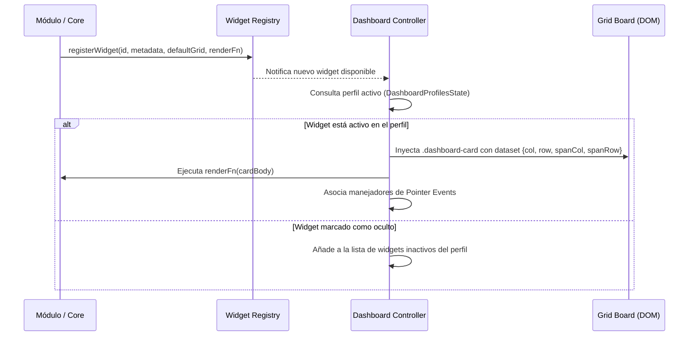
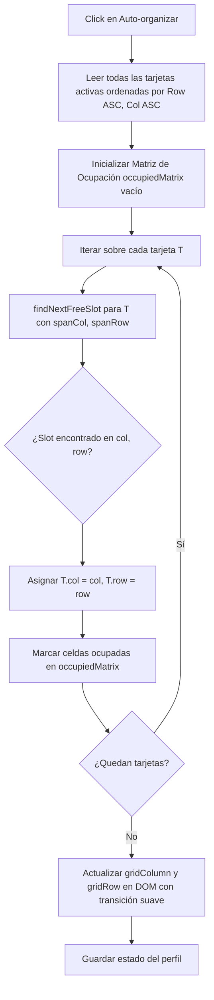
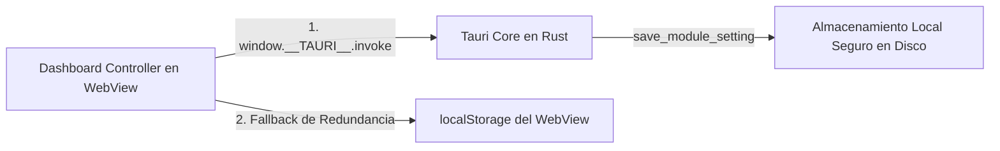

# Arquitectura Técnica del Dashboard, Drag and Drop y Widgets

Este documento detalla exhaustivamente el diseño arquitectónico, los modelos matemáticos y la implementación interna del sistema de **Dashboard**, **Widgets Modulares**, **Motor de Drag and Drop (Arrastre y Suelta)** y **Gestión de Perfiles** en el Core de **PC Manager**.

---

## 1. Visión General y Principios de Diseño

El sistema de visualización principal (denominado canónicamente **Dashboard**) opera como una cuadrícula matricial bidimensional desacoplada de flujos rígidos de maquetación HTML. A diferencia de interfaces tradicionales basadas en flujo de bloque (`block layout`) o flexbox unidimensional, el Dashboard de PC Manager implementa una **matriz de posicionamiento libre asistido por colisiones** sobre una cuadrícula CSS Grid programable en tiempo de ejecución.

### Principios Clave:
1. **Desacoplamiento Modular Total**: Los widgets no conocen la existencia de otros widgets ni la lógica interna del motor de arrastre. Se registran a través del contrato formal del Core.
2. **Cero Dependencia de HTML5 Drag & Drop Nativo**: La API estándar de arrastre de HTML5 adolece de problemas severos en entornos incrustados (WebView2 / Tauri), tales como bloqueos de eventos en elementos interactivos hijos (`input`, `select`, `button`), ghosting inconsistente y falta de control sobre el snapping continuo. Se diseñó un motor propio basado en la **Pointer Events API**.
3. **Persistencia No Destructiva ante Responsive**: El redimensionamiento de ventana o cambios de resolución no corrompen ni sobreescriben las coordenadas absolutas de las tarjetas.
4. **Perfiles Dinámicos con Aislamiento de Estado**: Los perfiles permiten múltiples vistas operativas sin duplicación de recursos en memoria.

---

## 2. Topología de la Cuadrícula Matricial Proporcional (Top-Down Derived Matrix)

### 2.1 Principio de Derivación Espacial (Cero Residuo y Modos Horizontal/Vertical)
A diferencia de aproximaciones "bottom-up" basadas en píxeles fijos arbitrarios (como 70px) que provocan huecos muertos al fondo por desajustes de división, el Dashboard de **PC Manager** adopta una **matriz top-down proporcional adaptativa**:

- **Modo Horizontal (Landscape 16:9 / Escritorio Estándar)**: **12 columnas $\times$ 8 filas**.
- **Modo Vertical (Portrait 9:16 / Monitores Verticales 1080x1920)**: **6 columnas $\times$ 14 filas**.

El tamaño de la celda unitaria se deriva dinámicamente de las dimensiones físicas netas del contenedor (`#grid-board`), garantizando que la multiplicación de filas y columnas sume con precisión micrométrica el 100% del área útil disponible:

$$\text{Ancho de Celda } (W_{\text{cell}}) = \frac{W_{\text{net}} - (C - 1) \times \text{gap}}{C} \quad \text{con } C = 12 \text{ (Landscape) o } 6 \text{ (Portrait)}$$

$$\text{Alto de Celda } (H_{\text{cell}}) = \frac{H_{\text{net}} - (R - 1) \times \text{gap}}{R} \quad \text{con } R = 8 \text{ (Landscape) o } 14 \text{ (Portrait)}$$

```css
#grid-board {
  display: grid;
  grid-template-columns: repeat(12, minmax(0, 1fr));
  grid-template-rows: repeat(8, minmax(0, 1fr));
  gap: 12px;
  position: relative;
  height: 100%;
  max-height: 100%;
  overflow: hidden !important;
  box-sizing: border-box;
}

@media (orientation: portrait), (max-aspect-ratio: 1/1) {
  #grid-board {
    grid-template-columns: repeat(6, minmax(0, 1fr)) !important;
    grid-template-rows: repeat(14, minmax(0, 1fr)) !important;
    gap: 10px !important;
  }
}
```

- **Divisibilidad Áurea de 12 Columnas (Landscape)**: Permite tarjetas de ancho completo (12 cols = 100%), mitad (6 cols = 50%), tercio (4 cols = 33.3%), cuarto (3 cols = 25%), sexto (2 cols = 16.6%) o unitarias (1 col = 8.3%).
- **Ergonomía Vertical en Modo Retrato (Portrait 6x14)**:
  - En monitores verticales (1080x1920), 14 filas producen celdas de ~110px de alto, emparejándose con el ancho de celda de ~113px para mantener una relación de aspecto 1:1 casi perfecta.
  - Se eliminan las hipertrofias verticales donde widgets panorámicos de 2 filas antes alcanzaban alturas gigantescas de 580px.
- **Lienzo Bounded con Residuo Cero**: Las filas absorben el 100% del alto disponible sin dejar jamás un solo píxel muerto o hueco al fondo.
- **Paso de Snapping Continuo**:
  - $\text{stepX} = W_{\text{cell}} + \text{gap}$
  - $\text{stepY} = H_{\text{cell}} + \text{gap}$
- **Límite Estricto de Capacidad y Arrastre**: $\text{maxAllowedRow} = R_{\text{max}} - \text{spanRow} + 1$. Toda tarjeta se contiene estrictamente dentro del límite visible ($R_{\text{max}} = 8$ en landscape, $14$ en portrait).

### 2.2 Coordenadas y Dimensiones de los Widgets

Cada tarjeta (`.card`) se define en la matriz mediante cuatro parámetros:

$$\text{Card} = \{ \text{col}, \text{row}, \text{spanCol}, \text{spanRow} \}$$

- $\text{col} \in [1, C_{\text{max}}]$: Índice de columna inicial (1-indexed según especificación CSS Grid).
- $\text{row} \in [1, R_{\text{max}}]$: Índice de fila inicial acotado.
- $\text{spanCol} \in [1, C_{\text{max}}]$: Número de columnas que abarca la tarjeta.
- $\text{spanRow} \in [1, R_{\text{max}}]$: Número de filas que abarca la tarjeta.

El posicionamiento en el DOM se aplica mediante propiedades CSS inline sobre cada elemento:

```javascript
card.style.gridColumn = `${displayCol} / span ${effSpanCol}`;
card.style.gridRow = `${row} / span ${spanRow}`;
```

---

## 3. Ciclo de Vida y Registro de Widgets

Los widgets son instanciados dinámicamente por los módulos o por el núcleo operativo. Cada widget declara sus propiedades métricas y su interfaz de renderizado:



### 3.1 Contrato de Datos del Widget

En el DOM, cada tarjeta almacena su estado en atributos `data-*`:
- `data-widget-id`: Identificador único canónico (ej. `core_storage_overview`).
- `data-col`: Coordenada absoluta de columna nominal en la cuadrícula de 10 columnas.
- `data-row`: Coordenada absoluta de fila.
- `data-span-col`: Ancho en celdas.
- `data-span-row`: Alto en celdas.

---

## 4. Motor de Drag and Drop (Arrastre y Suelta)

El motor fue implementado íntegramente en JavaScript vainilla utilizando **Pointer Events API** (`pointerdown`, `pointermove`, `pointerup`, `pointercancel`), garantizando compatibilidad unificada tanto para mouse como para dispositivos táctiles o stylus.

```mermaid
flowchart TD
    A[Pointer Down en .dashboard-card] --> B{¿Es elemento interactivo?}
    B -- Sí (input, button, switch) --> C[Ignorar Drag / Permitir interacción nativa]
    B -- No --> D[Registrar coordenadas iniciales de puntero]
    D --> E[Esperar movimiento de puntero]
    E --> F{¿Delta > DRAG_THRESHOLD (5px)?}
    F -- No --> G[Click estándar en tarjeta]
    F -- Sí --> H[Iniciar sesión de arrastre]
    H --> I[Crear Clon Flotante (.card-drag-clone)]
    H --> J[Ocultar tarjeta original (.card-dragging)]
    H --> K[Crear Indicador de Celda (.grid-drop-indicator)]
    K --> L[Capturar Pointermove en Window]
    L --> M[Calcular coordenadas proyectadas col, row]
    M --> N[Actualizar posición del indicador en Grid]
    L --> O[Actualizar posición del Clon en tiempo real]
    O --> P[Pointer Up / Drop]
    P --> Q[Resolver Colisiones AABB / Swapping]
    Q --> R[Asentar tarjeta original con animación .card-drop]
    R --> S[Destruir Clon e Indicador]
    S --> T[Persistir nueva configuración del perfil]
```

### 4.1 Detección de Intención y Umbral de Activación (`DRAG_THRESHOLD`)

Para permitir que los controles dentro de las tarjetas (botones de acción, selectores combobox, interruptores y campos de texto) funcionen sin activar un arrastre accidental, se evalúa:

1. **Filtro de Elementos Interactivos**:
   ```javascript
   const interactive = e.target.closest('button, input, select, .btn, .switch, label, a, .card-btn, textarea');
   if (interactive) return;
   ```
2. **Umbral de Distancia Euclidiana ($5\text{ px}$)**:
   El arrastre no comienza inmediatamente en `pointerdown`. Se calcula la distancia acumulada antes de tomar control de la interfaz:
   $$\Delta d = \sqrt{(x - x_0)^2 + (y - y_0)^2} > 5$$

### 4.2 Arquitectura del Clon Flotante y el Indicador de Snapping

Al confirmarse el arrastre:
- **Tarjeta Original**: Recibe la clase `.card-dragging`, reduciendo su visibilidad al $20\%$ para servir de referencia de origen.
- **Clon Flotante (`.card-drag-clone`)**:
  - Se clona el nodo de la tarjeta (`card.cloneNode(true)`).
  - Se inyecta directamente en `document.body` con posición fija (`position: fixed; pointer-events: none; z-index: 10000;`).
  - Conserva exactamente el ancho y alto medidos mediante `getBoundingClientRect()` para evitar saltos dimensionales.
  - Se le aplica una elevación tridimensional con sombra extendida, ligera escala de $1.02$ y una rotación de $1.5^\circ$ para brindar sensación de desprendimiento físico.
- **Indicador de Posición (`.grid-drop-indicator`)**:
  - Elemento con borde punteado de acento primario (`var(--accent-primary)`) y fondo semitransparente con desenfoque de fondo (`backdrop-filter`).
  - Se inserta en el `#grid-board` ocupando exactamente las mismas celdas de cuadrícula calculadas en caliente:
    ```javascript
    indicator.style.gridColumn = `${targetCol} / span ${spanCol}`;
    indicator.style.gridRow = `${targetRow} / span ${spanRow}`;
    ```

### 4.3 Cálculo Matemático de Snapping y Acoplamiento Vertical Coherente

En cada evento `pointermove`, se proyecta la posición del puntero dentro de la cuadrícula respetando las dimensiones físicas de la ventana para evitar desplazamientos al vacío:

1. Se obtiene el rectángulo del `#grid-board` mediante `grid.getBoundingClientRect()`.
2. Se descuenta el desplazamiento de scroll del contenedor principal (`dashboardSection.scrollTop`).
3. Se calculan las dimensiones efectivas de una celda:
   $$W_{\text{cell}} = \frac{W_{\text{grid}} - \text{pad}_{\text{left}} - \text{pad}_{\text{right}} - (C_{\text{cols}} - 1) \cdot \text{gap}}{C_{\text{cols}}}$$
   $$H_{\text{cell}} = 110\text{ px}$$
4. Coordenada relativa del puntero respecto al origen de la tarjeta:
   $$X_{\text{rel}} = X_{\text{pointer}} - \text{rect}_{\text{grid}}.left - \text{pad}_{\text{left}} - X_{\text{grabOffset}}$$
   $$Y_{\text{rel}} = Y_{\text{pointer}} - \text{rect}_{\text{grid}}.top - \text{pad}_{\text{top}} - Y_{\text{grabOffset}}$$
5. **Acoplamiento Magnético al Área Visible (`maxAllowedRow`)**:
   Para impedir que un widget se desplace a filas arbitrarias en el vacío generando barras de desplazamiento gigantescas y descontroladas, se calcula el límite vertical dinámico:
   $$\text{maxOccupiedRow} = \max_{c \in \text{OtherCards}} (c_{\text{row}} + c_{\text{spanRow}} - 1)$$
   $$\text{visibleRows} = \max\left( 2, \; \left\lfloor \frac{H_{\text{viewport}} - 2 \cdot \text{pad} + \text{gap}}{H_{\text{cell}} + \text{gap}} \right\rfloor \right)$$
   $$\text{maxAllowedRow} = \max\left( 1, \; \max(\text{visibleRows} - \text{spanRow} + 1, \; \text{maxOccupiedRow} + 1) \right)$$
6. Determinación de fila y columna por truncamiento de celda con límites de seguridad:
   $$\text{targetCol} = \text{clamp}\left( \left\lfloor \frac{X_{\text{rel}}}{W_{\text{cell}} + \text{gap}} \right\rfloor + 1, \; 1, \; C_{\text{cols}} - \text{spanCol} + 1 \right)$$
   $$\text{targetRow} = \text{clamp}\left( \left\lfloor \frac{Y_{\text{rel}}}{H_{\text{cell}} + \text{gap}} \right\rfloor + 1, \; 1, \; \text{maxAllowedRow} \right)$$

---

## 5. Detección y Resolución de Colisiones (Matriz de Ocupación Estricta)

Cuando el usuario suelta la tarjeta (`pointerup`), el sistema debe acomodar las tarjetas preexistentes garantizando **cero superposiciones**. Se emplea una matriz de ocupación bidimensional combinada con el modelo AABB.

### 5.1 Test de Intersección

Dos tarjetas $A$ y $B$ colisionan si y solo si se solapan simultáneamente en ambos ejes cartesianos:

$$\text{Colisión}(A, B) \iff \neg \Big( A_{\text{col2}} \le B_{\text{col1}} \lor A_{\text{col1}} \ge B_{\text{col2}} \lor A_{\text{row2}} \le B_{\text{row1}} \lor A_{\text{row1}} \ge B_{\text{row2}} \Big)$$

Donde:
$$A_{\text{col1}} = A_{\text{col}}, \quad A_{\text{col2}} = A_{\text{col}} + A_{\text{spanCol}}$$
$$A_{\text{row1}} = A_{\text{row}}, \quad A_{\text{row2}} = A_{\text{row}} + A_{\text{spanRow}}$$

### 5.2 Estrategia de Resolución: Swap Bidireccional Verificado y Cascada Libre

1. **Prioridad Absoluta del Usuario**:
   La tarjeta arrastrada ocupa inmediatamente $(targetCol, targetRow)$ y todas sus celdas se bloquean en la matriz `occupied`.
2. **Intercambio Verificado (1 a 1)**:
   Si la tarjeta arrastrada colisiona con **exactamente una tarjeta existente**:
   - Se evalúa si dicha tarjeta cabe limpiamente en la posición de origen $(origCol, origRow)$ de la tarjeta arrastrada.
   - Si no colisiona con ninguna celda ya ocupada ni con vecinos preexistentes, se ejecuta el *swap* simétrico.
3. **Reubicación en Cascada sin Superposiciones (`findNextFreeSlot`)**:
   - Si no es viable un swap limpio o si existen múltiples tarjetas en conflicto, las tarjetas afectadas se ordenan de arriba hacia abajo y de izquierda a derecha.
   - Cada tarjeta busca de forma determinista el primer hueco libre en la matriz `occupied` mediante `findNextFreeSlot`.
   - Se asegura que **ninguna celda pertenezca a más de una tarjeta**, eliminando al 100% las superposiciones.
4. **Contracción Dinámica del Contenedor**:
   Al mover widgets hacia arriba, las filas inferiores se colapsan automáticamente en CSS Grid y el sistema limpia cualquier scroll residual (`scrollTop = maxScroll`), asegurando que no queden áreas colgadas.

### 5.3 Asentamiento con Animación de Retorno (`.card-drop`)

Al soltar la tarjeta o al ser reubicada por colisión, se le añade temporalmente la clase `.card-drop` que aplica una función de aceleración `cubic-bezier(0.2, 0, 0, 1)` a nivel CSS durante 300ms, produciendo una desaceleración fluida y visualmente atractiva al asentarse en su celda definitiva.

---

## 6. Algoritmo de Auto-organización 2D (Bin-Packing Matricial)

El botón flotante canónico de Auto-organización (`.btn-fab` con icono de varita mágica) ejecuta un empaquetador espacial bidimensional sin fragmentación:



### 6.1 Matriz de Ocupación Espacial

La función `findNextFreeSlot(gridCols, spanCol, spanRow, occupied)` evalúa la disponibilidad celda por celda:

```javascript
function findNextFreeSlot(gridCols, spanCol, spanRow, occupied) {
  let r = 1;
  while (true) {
    for (let c = 1; c <= gridCols - spanCol + 1; c++) {
      let fits = true;
      for (let dr = 0; dr < spanRow; dr++) {
        for (let dc = 0; dc < spanCol; dc++) {
          if (occupied[`${c + dc},${r + dr}`]) {
            fits = false;
            break;
          }
        }
        if (!fits) break;
      }
      if (fits) return { col: c, row: r };
    }
    r++;
  }
}
```

Este algoritmo garantiza la eliminación absoluta de huecos muertos, manteniendo la jerarquía de lectura visual natural (de arriba a abajo y de izquierda a derecha).

---

### 2.3 Matriz de Formatos Soportados (19 Tamaños Canónicos)

El sistema soporta una matriz simétrica de 19 factores de forma clasificados por su idoneidad de orientación (`orientation: "horizontal" | "vertical" | "universal"`):

| Formato | Orientación | Propósito Operativo |
| :--- | :--- | :--- |
| `1x1` | ⊞ Universal | Micro-totalizador, porcentaje rápido o LED de estado. |
| `1x2` | ↕ Vertical | Torre métrica compacta vertical (2 filas). |
| `1x3` | ↕ Vertical | Torre métrica mediana vertical (3 filas). |
| `1x4` | ↕ Vertical | Torre métrica alta vertical (4 filas). |
| `2x1` | ↔ Horizontal | Chip métrico horizontal dual. |
| `2x2` | ⊞ Universal | Cuadrado estándar mediano (relojes, tacómetros). |
| `2x3` | ↕ Vertical | Columna vertical mediana. |
| `2x4` | ↕ Vertical | Columna vertical alta de diagnóstico. |
| `3x2` | ↔ Horizontal | Estándar 16:9 clásico de escritorio. |
| `3x4` | ↕ Vertical | Columna ancha vertical (ideal monitores 9:16). |
| `4x2` | ↔ Horizontal | Control extendido, cronómetro o temporizador con barra. |
| `4x3` | ↔ Horizontal | Historial mediano o gráfica en vivo. |
| `4x4` | ⊞ Universal | Cuadrado grande / consola unificada. |
| `4x6` | ↕ Vertical | Consola vertical extendida (diseñada para monitores 9:16). |
| `6x2` | ↔ Horizontal | Panorámico medio para telemetría multihilo. |
| `6x4` | ↔ Horizontal | Cuadrante del 50% de la pantalla. |
| `8x2` | ↔ Horizontal | Panorámico ancho de alta densidad. |
| `12x2` | ↔ Horizontal | Ancho completo (100% de 12 columnas en Landscape). |
| `banner` | ↔ Horizontal | Banner panorámico `1 / -1` span 2. |

---

### 2.4 Control Estricto de Capacidad (`canWidgetFitOnDashboard`)

Para prevenir el desorden, colisiones destructivas y redimensionamientos involuntarios al activar widgets desde el Drawer:

1. **Evaluación Preventiva**: Antes de alterar la visibilidad de una tarjeta (`card.style.display = 'flex'`), el sistema invoca `canWidgetFitOnDashboard(spanCol, spanRow, cardId)`.
2. **Matriz de Disponibilidad**: Se proyectan todas las tarjetas actualmente visibles en el perfil activo sobre la cuadrícula disponible ($C_{\text{actual}} \times R_{\text{max}}$).
3. **Búsqueda Bounded**: Se ejecuta `findNextFreeSlot` acotado a $R_{\text{max}}$ ($8$ en horizontal, $14$ en vertical).
4. **Bloqueo Determinista**: Si no existe ninguna celda contigua disponible donde quepa el widget sin desbordar $R_{\text{max}}$, la activación se aborta, el interruptor en el Drawer se revierte y se notifica al usuario con un toast de advertencia.

---

## 7. Adaptación Responsiva No Destructiva

Uno de los problemas más críticos en interfaces de cuadrícula libre es la pérdida de diseño cuando el usuario desmaximiza o redimensiona la ventana hacia anchos menores.

### 7.1 El Desafío de la Reducción de Columnas

Si una tarjeta fue colocada por el usuario en la columna $9$ de una cuadrícula de $12$ columnas, y la ventana se reduce a $8$ o $6$ columnas, la tarjeta quedaría fuera de los límites visibles si se forzara la posición absoluta. Sin embargo, si se sobreescribiera la coordenada original con la posición reducida, al volver a maximizar la ventana la tarjeta jamás volvería a la columna $9$.

### 7.2 Solución Implementada: Coordenadas Absolutas vs. Coordenadas de Presentación

Se implementó el desacoplamiento estricto entre:
1. **Coordenada Maestra Nominal (`dataset.col`, `dataset.row`)**: Almacenada en la tarjeta y en la base de datos de perfiles. Inmutable ante cambios de ancho de ventana.
2. **Coordenada de Presentación Calculada (`displayCol`, `displayRow`)**: Calculada dinámicamente por la función `adjustCardsForCurrentGridCols()` invocada por el `ResizeObserver` del contenedor y los breakpoints CSS:
   - Pantallas grandes / ventana maximizada (> 1360px): **12 columnas $\times$ 8 filas**.
   - Ventanas medianas ($\le$ 1360px): **8 columnas $\times$ 6 filas**.
   - Ventanas compactas / no maximizadas ($\le$ 1080px): **6 columnas $\times$ 6 filas**.

$$\text{displayCol} = \min\left( \text{dataset.col}, \; C_{\text{actual}} - \text{effSpanCol} + 1 \right)$$
$$\text{effSpanCol} = \min\left( \text{dataset.spanCol}, \; C_{\text{actual}} \right)$$

Al restaurar o maximizar la ventana, $C_{\text{actual}}$ retorna a $12$, por lo que $\text{displayCol}$ vuelve a reflejar exactamente el $\text{dataset.col}$ original sin desfase alguno.

### 7.3 Protección Interna de Contenido mediante Container Queries (`@container`)

Para evitar que el contenido interno de las tarjetas (botones, números, etiquetas de cabecera) se apretuje o se desborde cuando la ventana se achica o un widget se ubica en columnas compactas:
1. **Contenedor Aislado**: `.card` declara `container-type: inline-size; container-name: card;`.
2. **Adaptación Elástica (< 280px)**: Mediante `@container card (max-width: 280px)`, se reducen automáticamente paddings, gaps entre botones y tamaños tipográficos sin romper el layout ni cortar botones de acción.
3. **Protección de Títulos**: `.card-title-box h4` utiliza `clamp(11.5px, 1.25vw, 13px)` combinado con `white-space: nowrap; overflow: hidden; text-overflow: ellipsis;` para garantizar que palabras largas (ej. "Temporizador") nunca se partan en sílabas deformadas.

---

## 8. Sistema de Perfiles y Catálogo de Widgets

El sistema soporta múltiples perfiles de usuario configurables para organizar diferentes escenarios de trabajo (ej. *Monitoreo General*, *Desarrollo y Depuración*, *Servicios de Red*).

### 8.1 Estructura del Estado de Perfiles (`dashboardProfilesState`)

```typescript
interface DashboardProfile {
  id: string;                      // Identificador único (ej. "default", "profile_1726354890")
  name: string;                    // Nombre legible en interfaz
  cardPositions: Record<string, {  // Diccionario por widgetId
    col: number;
    row: number;
  }>;
  hiddenWidgets: string[];         // Lista de widgets apagados en este perfil
}

interface DashboardProfilesState {
  activeProfileId: string;
  profiles: DashboardProfile[];
}
```

### 8.2 Principio de Lienzo en Blanco para Nuevos Perfiles

Al crear un nuevo perfil mediante el botón de creación (`+`):
- El Core **no clona ni copia** los widgets activos del perfil previo.
- El perfil nuevo nace como un **lienzo en blanco**: su lista `hiddenWidgets` se inicializa conteniendo todos los identificadores de widgets registrados en el sistema.
- El usuario utiliza el **Drawer de Catálogo de Widgets** para activar de forma intencional y limpia únicamente los widgets que necesita en esa vista.
- Si el usuario desea basarse en su distribución previa, el sistema provee la acción explícita de **Duplicar Perfil Actual**.

### 8.3 Inmutabilidad del Perfil Predeterminado

El perfil `"default"` (*Predeterminado*) es canónico e inborrable. La interfaz desactiva automáticamente los botones de eliminación para proteger la estabilidad del sistema base. Si un perfil secundario es eliminado, el Core conmuta de forma transparente al perfil `"default"`.

### 8.4 Catálogo de Widgets en Drawer con Acordeones Colapsables por Módulo

Para prevenir el desplazamiento infinito cuando existen decenas de widgets instalados:
- Los widgets se agrupan automáticamente bajo el nombre de su módulo emisor (`grp.module.name`).
- Cada grupo funciona como un **acordeón colapsable por defecto**, mostrando el icono del módulo, el total de widgets disponibles y cuántos están activos en el perfil actual.
- El usuario puede desplegar únicamente los módulos que desea configurar, manteniendo el drawer limpio y organizado.

---

## 9. Capa de Persistencia Dual (IPC Rust + LocalStorage)

La persistencia de la distribución matricial y los perfiles opera en dos niveles sincronizados para máxima resiliencia:



1. **Persistencia Primaria en Backend Nativo (Rust / Tauri)**:
   El estado se serializa en formato JSON y se envía al comando IPC `save_module_setting`:
   - Módulo: `"core_dashboard"`.
   - Clave: `"profiles_config"`.
   - Payload: Objeto serializado con `activeProfileId` y el array completo de `profiles`.
2. **Fallback y Caché de Redundancia (LocalStorage)**:
   Para arranques ultrarrápidos previos a la conexión IPC de Tauri, el estado se replica en `localStorage.getItem('pcm_dashboard_profiles_v1')`.

---

## 10. Resumen de Archivos y Responsabilidades

| Archivo | Responsabilidad Arquitectónica |
| :--- | :--- |
| `ui/index.html` | Implementación del motor de Drag and Drop, lógica de colisiones AABB, algoritmo Bin-Packing, observador de redimensionamiento responsivo, y gestión del estado de perfiles. |
| `core_shell.html` | Maqueta canónica de referencia para la versión limpia de fábrica sin módulos de terceros. |
| `src-tauri/src/modules/mod.rs` | Gestión del ciclo de vida, persistencia centralizada y servicios compartidos (`ServiceRegistry`). |
| `src-tauri/src/commands.rs` | Comandos IPC (`get_module_setting`, `save_module_setting`, `get_system_specs`). |
