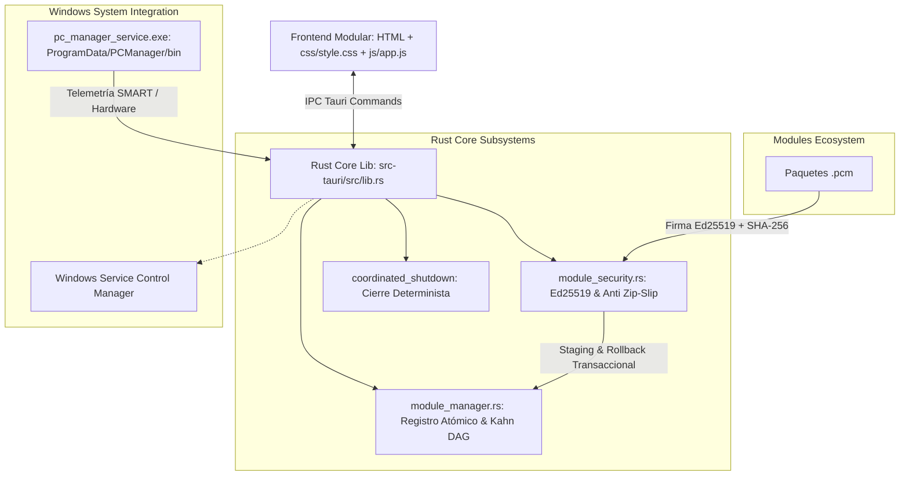
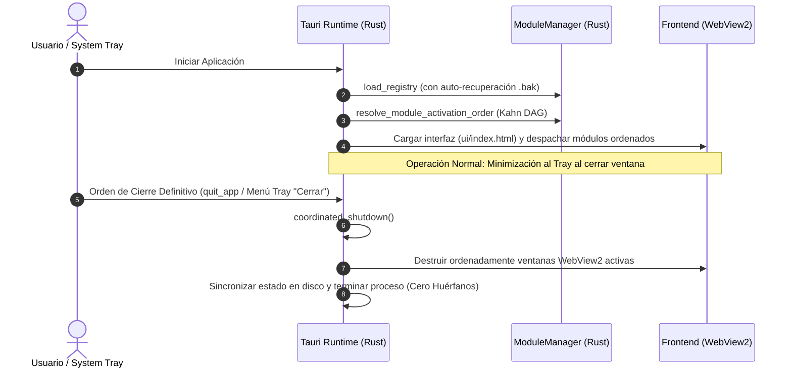

# Guía del Desarrollador: PC Manager Core (v0.0.4)

Esta guía documenta la arquitectura técnica, contratos de programación, interfaces de extensibilidad y patrones de diseño utilizados en el núcleo (**Core**) de **PC Manager**.

---

## 1. Arquitectura Nativa de Escritorio (Rust + Tauri + WebView2)

El Core actúa como un microkernel nativo en Rust que administra el ciclo de vida, la seguridad criptográfica y la persistencia atómica, exponiendo comandos tipados a través del IPC de Tauri hacia la interfaz gráfica de usuario.



---

## 2. Ciclo de Vida y Flujo de Secuencia

El ciclo de ejecución garantiza que el arranque, la inicialización de módulos respetando dependencias, y la detención definitiva se realicen en un orden determinista y seguro (Reglas 0 y 8).



---

## 3. Contratos e Interfaces Principales

### 3.1. Ordenamiento Topológico y Validación de Dependencias (Kahn DAG)

En [`src-tauri/src/module_manager.rs`](file:///c:/Proyectos/pc_manager/src-tauri/src/module_manager.rs):
- `resolve_module_activation_order(modules)`: Evalúa el grafo acíclico dirigido (DAG) de los módulos activos.
- **Desempate Alfabético Determinista**: Orden de arranque 100% reproducible entre ejecuciones.
- **Detección de Ciclos**: Intercepta dependencias circulares (A $\to$ B $\to$ A) devolviendo error descriptivo sin colapsar el Core.
- **Validación de Cascada**: Impide la desinstalación o desactivación de un módulo si existen módulos activos que dependen de él.
- **Comando IPC**: `get_modules_initialization_order`.

### 3.2. Persistencia Atómica con Auto-Recuperación

- `save_registry_to_dir`: Guardado en dos fases (`registry.json.tmp` $\to$ volcado a disco forzado con `sync_all` $\to$ respaldo a `registry.json.bak` $\to$ reemplazo atómico).
- `load_registry_from_dir`: Comprueba la integridad de `registry.json`. Si se detecta corrupción, restaura automáticamente el estado desde `registry.json.bak`. Si ambos están corruptos, preserva el archivo como `registry.json.corrupt_<timestamp>` para auditoría sin detener el programa.

### 3.3. Instalación Transaccional y Reversión (Rollback)

- Extracción en `.staging/<id>_<timestamp>/`.
- Cuotas de seguridad estrictas: 25 MB por paquete, 60 MB descomprimido total, 20 MB por archivo, máximo 250 archivos.
- Validación anti Zip-Slip con `validate_zip_entry_path`.
- Respaldo automático de la versión previa en `.backup/<id>/` ante actualizaciones.
- Promoción atómica a `modules/<id>/`. En caso de error, restauración inmediata del estado previo.

### 3.4. Parada Coordinada Determinista (`coordinated_shutdown`)

En [`src-tauri/src/lib.rs`](file:///c:/Proyectos/pc_manager/src-tauri/src/lib.rs):
- `coordinated_shutdown(app)`: Itera sobre todas las ventanas activas (`webview_windows()`), las destruye de forma secuencial y limpia, liberando recursos del sistema operativo antes de ordenar `app.exit(0)`.

---

## 4. Estructura Modular del Frontend

El frontend reside en [`ui/`](file:///c:/Proyectos/pc_manager/ui/) con una arquitectura modular y desacoplada:

```text
ui/
├── index.html        (Shell HTML canónico limpio: 884 líneas)
├── css/
│   └── style.css     (Sistema de diseño Material Expressive y variables de tema: 2,006 líneas)
├── js/
│   └── app.js        (Lógica integral de UI, controladores de eventos e IPC: 4,720 líneas)
└── vendor/
    └── jszip.min.js  (Dependencia vendor local)
```

---

## 5. Guía de Verificación y Pruebas

Para validar el sistema completo según las directivas del proyecto (Reglas 9 y 10):

```powershell
# 1. Pruebas unitarias de Rust (Criptografía, Kahn DAG, Registry Atómico, Zip-Slip)
cd src-tauri
cargo test --lib

# 2. Compilación del binario nativo de escritorio y servicio de fondo
cargo build

# 3. Pruebas de integración del microkernel JS
cd ..
npm test
```

