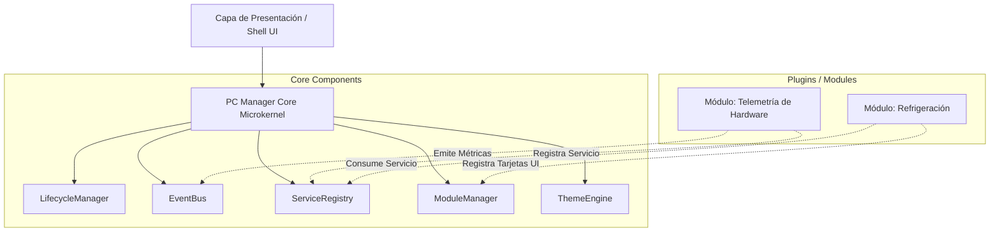
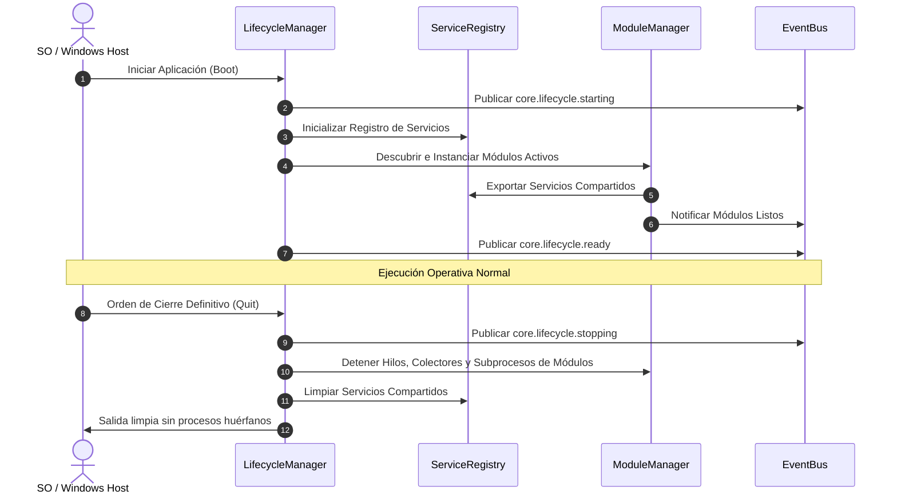

# Guía del Desarrollador: PC Manager Core (Alpha 0.0.1)

Esta guía documenta la arquitectura técnica, contratos de programación, interfaces de extensibilidad y patrones de diseño utilizados en el núcleo (**Core**) de **PC Manager**.

---

## 1. Arquitectura Microkernel

El Core actúa como un orquestador mínimo que no contiene lógica de negocio específica de hardware o diagnósticos particulares.



---

## 2. Ciclo de Vida y Flujo de Secuencia

El ciclo de ejecución garantiza que el arranque, la inicialización de servicios y la detención definitiva se realicen en un orden determinista y seguro.



---

## 3. Contratos e Interfaces Principales

### 3.1. Contrato de Módulo (`ModuleContract`)

Todo módulo debe exportar un objeto o clase compatible con la interfaz canónica:

```javascript
export class BaseModule {
  /**
   * Identificador único en formato kebab-case.
   * @type {string}
   */
  id = 'modulo-ejemplo';

  /**
   * Nombre legible para visualización neutral.
   * @type {string}
   */
  name = 'Ejemplo de Diagnóstico';

  /**
   * Versión SemVer del módulo.
   * @type {string}
   */
  version = '0.0.1';

  /**
   * Grupo al que pertenece ('General' por defecto).
   * @type {string}
   */
  group = 'General';

  /**
   * Dependencias obligatorias de otros módulos.
   * @type {string[]}
   */
  dependencies = [];

  /**
   * Servicios que este módulo exporta al ServiceRegistry.
   * @returns {Array<{ id: string, version: string, instance: any }>}
   */
  getProvidedServices() {
    return [];
  }

  /**
   * Método de inicialización invocado tras resolver dependencias.
   * @param {CoreContext} context
   */
  async init(context) {
    // context.eventBus, context.serviceRegistry, context.logger
  }

  /**
   * Liberación determinista de recursos al detener o desinstalar.
   */
  async destroy() {
    // Detener timers, sockets, colectores
  }
}
```

### 3.2. Contrato de `ServiceRegistry`

Permite el intercambio desacoplado de capacidades entre módulos:

- `registerService(id, version, provider, instance)`: Registra un servicio compartido. Valida colisiones de identificador.
- `getService(id)`: Retorna la instancia de un servicio registrado. Lanza error descriptivo si el servicio no está disponible.
- `hasService(id)`: Comprobación no bloqueante de disponibilidad.
- `unregisterService(id)`: Elimina un servicio al desactivarse su proveedor.

### 3.3. Contrato de `ModuleManager`

Responsable de la carga y agrupamiento:

- `registerModule(moduleInstance)`: Valida interfaz, dependencias y grupo.
- `unregisterModule(moduleId)`: Llama a `destroy()` del módulo y reacomoda la interfaz.
- `setModuleEnabled(moduleId, boolean)`: Habilita o pausa el módulo. Si el grupo al que pertenece queda sin módulos habilitados, dicho grupo se oculta visualmente.
- `createGroup(groupName)`: Crea una nueva categoría en el menú lateral.
- `deleteGroup(groupName)`: Elimina el grupo personalizado. Los módulos contenidos se migran automáticamente al grupo inborrable **"General"**.

---

## 4. Manejo de Errores y Aislamiento

1. **Sandboxing de Errores en Módulos**:
   - Todo llamado a `module.init()` o renderizado de tarjeta en el Dashboard se envuelve en un bloque `try/catch`.
   - Si un módulo arroja una excepción no controlada, se marca en estado `ERROR` y se aíslan sus fallos para no interrumpir el funcionamiento del Core ni de los demás módulos.
2. **Ciclo de Vida en Windows**:
   - Soporte para eventos de sistema `beforeunload` y señales `SIGTERM`/`SIGINT`.
   - La directiva de cierre total ejecuta `LifecycleManager.stop()` síncrona y deterministamente antes de cerrar la ventana o el proceso de fondo.

---

## 5. Guía de Verificación y Pruebas

Para validar la integridad de los componentes del Core:

```powershell
# Comprobar sintaxis de los archivos fuente
Get-ChildItem -Path "src/core/*.js" | ForEach-Object { node --check $_.FullName }

# Ejecutar auditoría de marca blanca
Get-ChildItem -Path "src" -Recurse -Filter "*.js" | Select-String -Pattern "C:\\Users"
```
