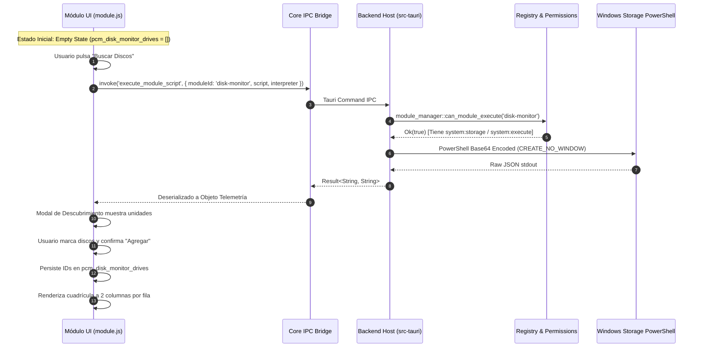

# Guía de Desarrollador: Módulo de Monitoreo de Almacenamiento (`disk-monitor`)

Guía técnica de arquitectura, contratos de ciclo de vida e integración para ingenieros del proyecto **PC Manager Core-Modular**.

---

## 1. Arquitectura del Módulo y Flujo de Datos

El módulo opera totalmente desacoplado del núcleo (arquitectura Microkernel) y sigue el patrón de permisos declarativos y suscripción activa:



---

## 2. API Global y Contratos de Interfaz

### `window.__DISK_MONITOR__`
Objeto expuesto por el script del módulo para la interacción con la vista:
- `openDiscoveryModal(): Promise<void>`: Consulta el bus de almacenamiento y abre la ventana de selección de unidades con soporte para discos fijos y unidades extraíbles USB.
- `closeDiscoveryModal(): void`: Cierra la ventana modal de descubrimiento.
- `updateDiscoveryCount(): void`: Actualiza el contador de unidades seleccionadas en tiempo real.
- `addSelectedDisks(): void`: Guarda la lista de identificadores seleccionados en `pcm_disk_monitor_drives` y redibuja el tablero en cuadrícula de 2 columnas por fila.
- `removeMonitoredDisk(deviceId: string): void`: Elimina una unidad física de la lista vigilada.
- `refreshWatchedDisks(): Promise<void>`: Fuerza una actualización de telemetría de las unidades activas.
- `setFilter(filter: string): void`: Aplica filtros visuales por tecnología (`all`, `nvme`, `ssd`, `hdd`, `usb`, `alerts`).
- `openRealAudit(deviceId: string): void`: Abre el modal de diagnóstico técnico con contadores de lectura/escritura y eventos reales del registro de Windows (IDs 7, 55, 98, 153).
- `closeAuditModal(): void`: Cierra la ventana de diagnóstico de bloques.

### Manejador Dinámico de Configuraciones (`__SETTING_CHANGE_disk_monitor__`)
- Procesa cambios en caliente para `auto_refresh`, `refresh_interval` y `custom_interval_seconds`, ajustando dinámicamente el temporizador de muestreo en segundo plano.

### Ciclo de Vida, Limpieza y Purga Canónica (`__CLEANUP_disk_monitor__`, `__PURGE_disk_monitor__`)
Al desactivarse o desinstalarse el módulo:
1. Cancela el temporizador de muestreo en segundo plano (`refreshTimer`).
2. Aborta cualquier auditoría de sectores en curso (`auditInterval`).
3. Desregistra el servicio `storage.telemetry` del registro central `ServiceRegistry`.
4. Si se indica desinstalación o purga (`opts.purge`), remueve permanentemente las claves de `localStorage` (`pcm_disk_monitor_drives`, `pcm_monitored_drives`).
5. Elimina las referencias globales de la ventana del navegador.

---

## 3. Empaquetado y Distribución

Para empaquetar el módulo como un archivo `.pcm` estándar:
```powershell
node build_disk_monitor_pcm.cjs
```
El archivo `disk-monitor.pcm` resultante en la raíz del proyecto es un paquete comprimido que contiene:
- `manifest.json`: Metadatos formales, permisos, vistas y `meta_options`.
- `module.js`: Lógica de presentación y telemetría.
- `README.md`: Documentación del paquete.

El usuario realiza la instalación de forma manual a través del **Gestor de Módulos** en la interfaz gráfica para verificar el pipeline completo de carga de extensiones.
