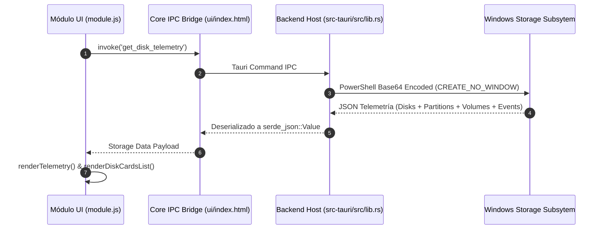

# Guía de Desarrollador: Módulo de Monitoreo de Almacenamiento (`disk-monitor`)

Guía técnica de arquitectura, contratos e integración para desarrolladores del ecosistema **PC Manager Core-Modular**.

---

## 1. Arquitectura y Flujo de Secuencia

El módulo `disk-monitor` utiliza una arquitectura híbrida desacoplada entre el runtime nativo de Tauri (Rust) y la capa de presentación Web en WebView2:



---

## 2. Contratos y Métodos Principales

### `window.__DISK_MONITOR__`
Objeto expuesto en el ámbito global del WebView para orquestar la vista:
- **`scanDisks(): Promise<void>`**: Solicita la telemetría actualizada y refresca las tarjetas y resúmenes.
- **`toggleWatch(deviceId: string, isChecked: boolean): void`**: Modifica la lista de discos vigilados en `localStorage` (`pcm_watched_disks`) y actualiza el estilo de opacidad.
- **`setFilter(filter: 'all' | 'watched' | 'nvme' | 'ssd' | 'hdd' | 'alerts'): void`**: Alterna la visualización activa de tarjetas.
- **`startSectorAudit(deviceId: string, diskName: string, techType: string): void`**: Abre el modal de auditoría y ejecuta el proceso de inspección no destructiva.
- **`cancelAudit(): void`**: Aborta cualquier auditoría activa en curso.
- **`closeAuditModal(): void`**: Cierra el panel de auditoría.

### Manejo de Ciclo de Vida y Limpieza
El módulo registra su hook de teardown en `window.__CLEANUP_disk_monitor__`:
- Cancela el temporizador de muestreo en segundo plano (`refreshTimer`).
- Aborta cualquier auditoría de sectores activa (`auditInterval`).
- Desregistra el servicio compartido en `ServiceRegistry`.
- Elimina el objeto `window.__DISK_MONITOR__` y limpia referencias residuales.

---

## 3. Manejo de Errores y Casos Límite

1. **Permisos Restringidos**: Si el usuario ejecuta la aplicación sin permisos de administrador, el comando PowerShell captura los datos disponibles de `Get-PhysicalDisk`, `Get-Partition` y `Get-Volume` y suprime los errores de clases restringidas (`-ErrorAction SilentlyContinue`).
2. **Entornos Desacoplados o Navegador**: Si la invocación a Tauri no está disponible (ej. previsualización estática), la vista muestra una notificación limpia con botón de reintento en lugar de generar excepciones no controladas.
3. **Discos sin Letra de Unidad Asignada**: Las particiones de recuperación o particiones EFI no montadas se identifican como particiones sin letra y se omiten de la lista de volúmenes de usuario para evitar saturación visual.

---

## 4. Guía de Pruebas y Empaquetado

### Empaquetado del Módulo (.pcm)
Para generar el paquete empaquetado y firmado para distribución:
```powershell
node build_disk_monitor_pcm.cjs
```
Esto genera `disk-monitor.pcm` en la raíz del proyecto conteniendo `manifest.json`, `module.js` y `README.md`.

### Compilación y Prueba del Binario Nativo
```powershell
cd src-tauri
cargo build
.\target\debug\pc_manager.exe
```
