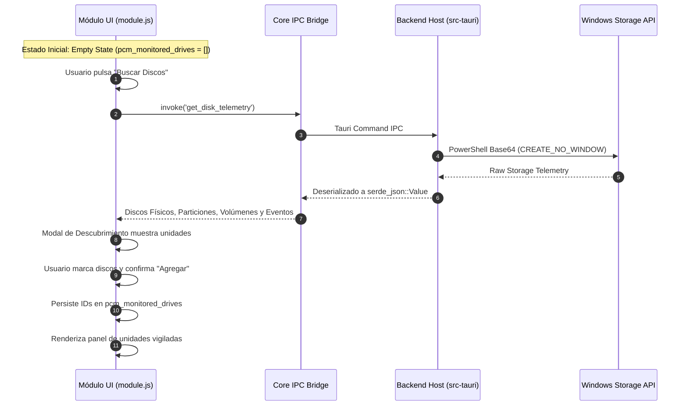

# Guía de Desarrollador: Módulo de Monitoreo de Almacenamiento (`disk-monitor`)

Guía técnica de arquitectura, contratos de ciclo de vida e integración para ingenieros del proyecto **PC Manager Core-Modular**.

---

## 1. Arquitectura del Módulo y Flujo de Datos

El módulo opera desacoplado del núcleo y sigue el patrón de descubrimiento y suscripción activa:



---

## 2. API Global y Contratos de Interfaz

### `window.__DISK_MONITOR__`
Objeto expuesto por el script del módulo para la interacción con la vista:
- `openDiscoveryModal(): Promise<void>`: Consulta el bus de almacenamiento y abre la ventana de selección de unidades.
- `closeDiscoveryModal(): void`: Cierra la ventana modal de descubrimiento.
- `updateDiscoveryCount(): void`: Actualiza el contador de unidades seleccionadas en tiempo real.
- `addSelectedDisks(): void`: Guarda la lista de identificadores seleccionados en `pcm_monitored_drives` y redibuja el tablero.
- `removeMonitoredDisk(deviceId: string): void`: Elimina una unidad física de la lista vigilada.
- `refreshWatchedDisks(): Promise<void>`: Fuerza una actualización de telemetría de las unidades activas.
- `setFilter(filter: string): void`: Aplica filtros visuales por tecnología o estado de alerta.
- `startSectorAudit(deviceId: string, diskName: string, techLabel: string): void`: Inicia la rutina no destructiva de comprobación de lectura de bloques.

### Ciclo de Vida y Limpieza Canónica (`__CLEANUP_disk_monitor__`)
Al desactivarse o desinstalarse el módulo:
1. Cancela el temporizador de muestreo en segundo plano (`refreshTimer`).
2. Aborta cualquier auditoría de sectores en curso (`auditInterval`).
3. Desregistra el servicio `storage.telemetry` del registro central `ServiceRegistry`.
4. Elimina la referencia `window.__DISK_MONITOR__` del ámbito global.

---

## 3. Empaquetado y Distribución

Para empaquetar el módulo como un archivo `.pcm` estándar:
```powershell
node build_disk_monitor_pcm.cjs
```
El archivo `disk-monitor.pcm` resultante en la raíz del proyecto es un paquete comprimido que contiene:
- `manifest.json`: Metadatos formales, permisos, vistas y `meta_options`.
- `module.js`: Lógica de presentación y telemetría.
- `README.md`: Documentación del paquete.

El usuario realiza la instalación de forma manual a través del **Gestor de Módulos** en la interfaz gráfica para verificar el pipeline completo de carga de extensiones.
