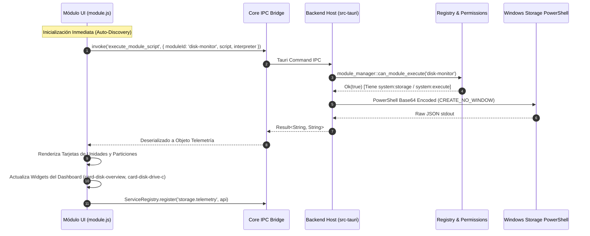

# Guía de Desarrollador: Módulo de Monitoreo de Almacenamiento (`disk-monitor` v2.0)

Guía técnica de arquitectura, contratos de ciclo de vida e integración para ingenieros del proyecto **PC Manager Core-Modular**.

---

## 1. Arquitectura del Módulo y Flujo de Datos

El módulo opera totalmente desacoplado del núcleo (arquitectura Microkernel) y sigue el patrón de permisos declarativos y suscripción activa:

---

## 2. API Global y Contratos de Interfaz

### `window.__DISK_MONITOR__`
Objeto expuesto por el script del módulo para la interacción con la vista:
- `refreshDisks(): Promise<void>`: Fuerza una actualización de telemetría de todas las unidades físicas y volúmenes montados.
- `setFilter(filter: string): void`: Aplica filtros visuales por tecnología (`all`, `nvme`, `ssd`, `hdd`, `usb`).
- `openAuditModal(): void`: Abre la ventana modal de eventos de almacenamiento del sistema operativo.
- `closeAuditModal(): void`: Cierra la ventana modal de eventos.

### Widgets Registrados en Manifiesto
1. `card-disk-overview` (2x1, universal):
   - Muestra barra de almacenamiento total usado/libre y conteo de discos saludables.
2. `card-disk-drive-c` (2x1, universal):
   - Muestra porcentaje de ocupación de la unidad del sistema (C:), espacio libre y temperatura en vivo.

### Manejador Dinámico de Configuraciones (`__SETTING_CHANGE_disk_monitor__`)
- Procesa cambios en caliente para `auto_refresh`, `refresh_interval`, `include_usb` y `notify_health_change`, ajustando dinámicamente el temporizador de muestreo en segundo plano.

### Ciclo de Vida y Limpieza Canónica (`__CLEANUP_disk_monitor__`)
Al desactivarse o desinstalarse el módulo:
1. Cancela el temporizador de muestreo en segundo plano (`refreshTimer`).
2. Desregistra `window.__DISK_MONITOR__` y `window.__SETTING_CHANGE_disk_monitor__`.
3. Desregistra el servicio `storage.telemetry` del registro central `ServiceRegistry`.

---

## 3. Autonomía y Empaquetado (Regla 13)

El módulo reside de forma autocontenida en `modules/disk-monitor/`:
- `package.cjs`: Empaqueta los archivos locales en `disk-monitor.pcm` y genera la firma Ed25519 oficial.
- `test.cjs`: Valida el esquema del manifiesto, la sintaxis de JavaScript, la seguridad estática del script PowerShell y la validez criptográfica del paquete.
